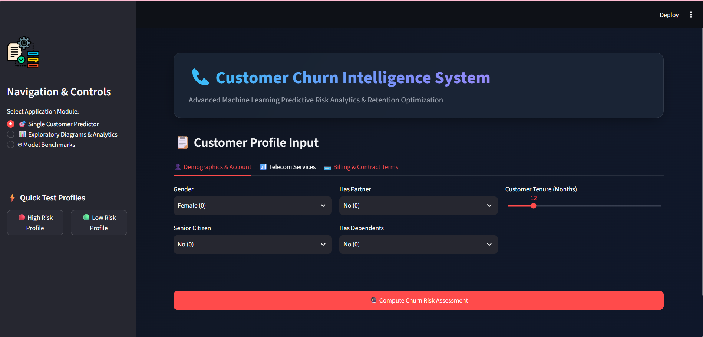
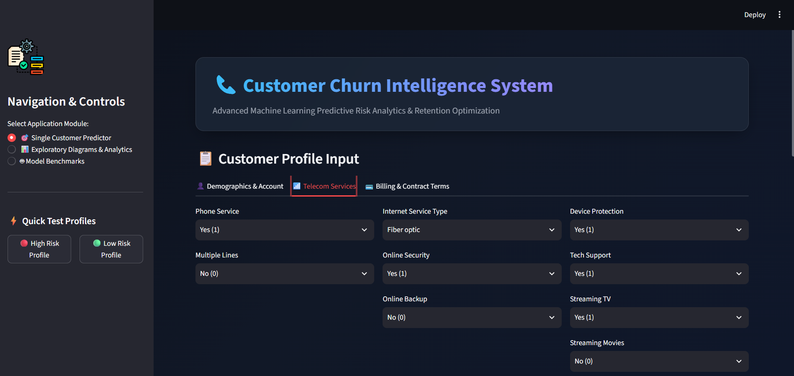
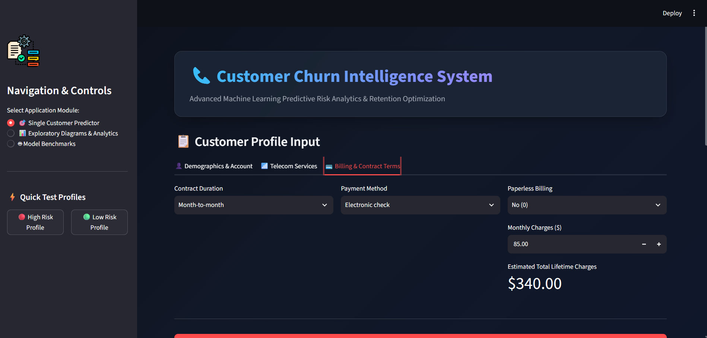
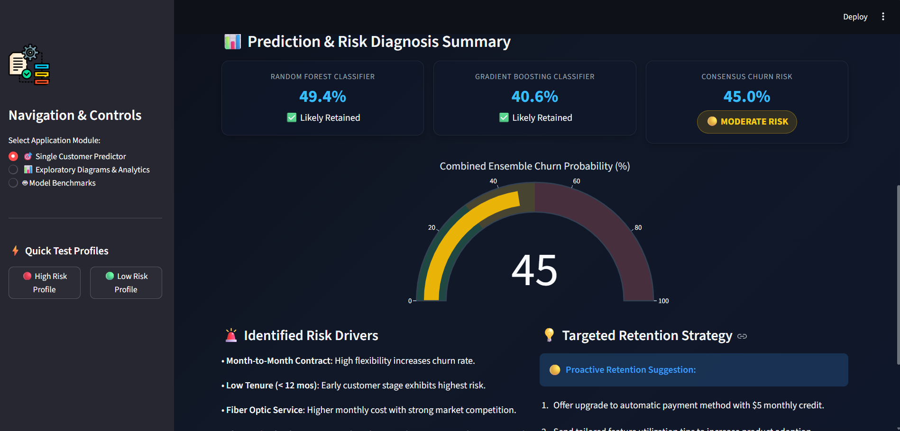

# 📊 Customer Churn Analysis & Prediction


An end-to-end Machine Learning project that predicts customer churn using customer information. The project includes data preprocessing, exploratory data analysis, feature engineering, model training, evaluation, and deployment using a Flask web application.


---

# 📌 Project Overview

Customer churn prediction is one of the most important applications of Machine Learning in the telecom industry. This project analyzes customer behavior and predicts whether a customer is likely to leave the company.

The project includes:

- Data Cleaning
- Exploratory Data Analysis (EDA)
- Feature Engineering
- Data Preprocessing
- Machine Learning Model
- Flask Web Application
- Real-time Customer Churn Prediction

---

# 🚀 Demo

### 🌐 Live Demo

> **Coming Soon**


---

# 📂 Project Structure

```text
Customer-Churn-Analysis-and-Prediction
│
├── Dataset
├── Diagram
├── Results
├── templates
├── static
├── model.pkl
├── scaler.pkl
├── app.py
├── requirements.txt
├── notebook.ipynb
└── README.md
```

---

# 🔄 Workflow

```text
Customer Dataset
       │
       ▼
Data Cleaning
       │
       ▼
Exploratory Data Analysis
       │
       ▼
Feature Engineering
       │
       ▼
Data Preprocessing
       │
       ▼
Train Test Split
       │
       ▼
Random Forest Model
       │
       ▼
Model Evaluation
       │
       ▼
Save Model (.pkl)
       │
       ▼
Flask Web Application
       │
       ▼
Customer Churn Prediction
```

---

# 🛠 Tech Stack

### Programming Language

- Python

### Machine Learning

- Scikit-learn

### Data Analysis

- Pandas
- NumPy

### Visualization

- Matplotlib
- Seaborn

### Web Framework

- Flask

### Dashboard

- Power BI

### Version Control

- Git
- GitHub

---

# 📚 Libraries Used (app.py)

- Flask
- Pandas
- NumPy
- Scikit-learn
- Pickle
- Joblib

---

# ✨ Features

✅ Customer Churn Prediction

✅ Interactive Flask Web Application

✅ Machine Learning Model Deployment

✅ User Friendly Interface

✅ Real-time Prediction

✅ Data Visualization

---

# 🤖 Machine Learning Model

### Model Used

- Random Forest Classifier

### Preprocessing

- Missing Value Handling
- Label Encoding
- Feature Scaling
- Train Test Split

---

# 📸 Diagrams


---


---


---

## 📈 Prediction Output



---

# ▶️ Run Locally

```bash
git clone https://github.com/AnkitSharma9660/Customer-Churn-Analysis-and-Prediction

cd Customer-Churn-Analysis-and-Prediction

pip install -r requirements.txt

python app.py
```

---

# 🚀 Future Improvements

- Deep Learning Model
- Hyperparameter Tuning
- Docker Deployment
- Cloud Deployment
- Authentication System
- Database Integration

